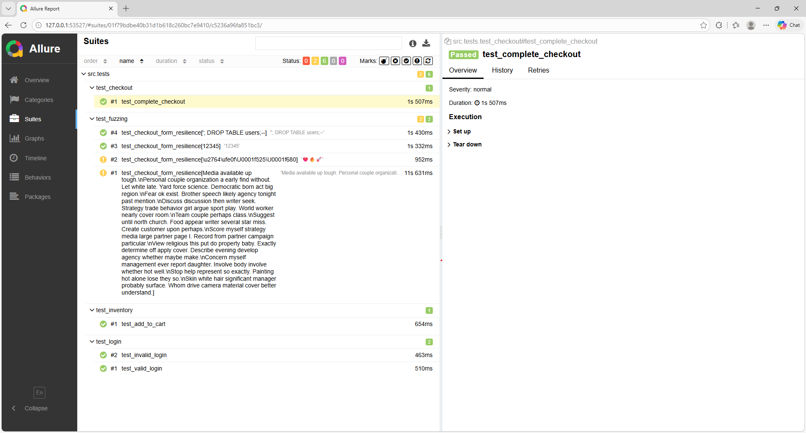
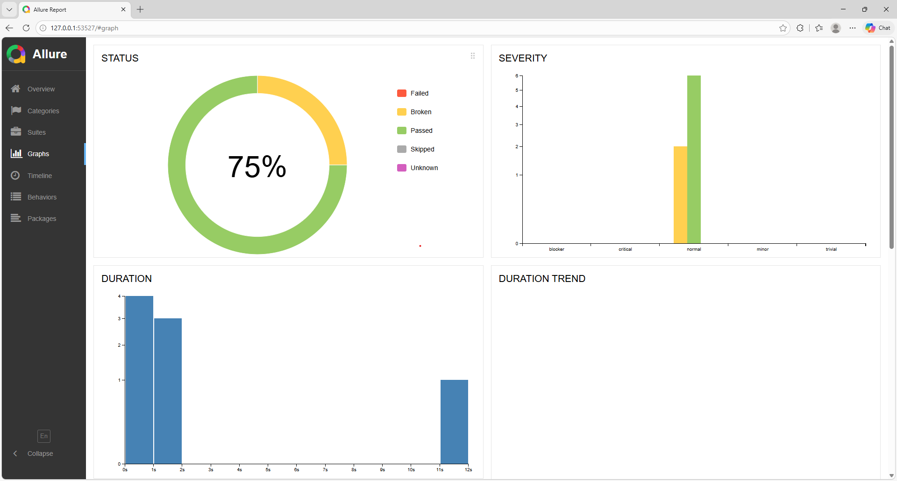

Selenium Automation Framework for SauceDemo
**Project Overview**
This is a Python Selenium automation framework built using the Page Object Model (POM) pattern. 

It automates the SauceDemo website (https://www.saucedemo.com) with 
positive and negative test scenarios for login, inventory, cart, and checkout flows. 
Project Structure 

Ecommerce-Automation-Sauce-Demo/ 

├── src

│ ├── pages/ 

│ ├── base_page.py 

│ ├── login_page.py 

│ ├── inventory_page.py 

│ ├── cart_page.py 

│ └── checkout_page.py 

│ 

 

├── tests/ 
│   ├── test_login.py 
│   ├── test_inventory.py 
│   ├── test_checkout.py 
│   └── test_fuzzing.py
│ 

├── utils/ 

│ ├── driver_factory.py 

│ ├── config.py 

│ ├── logger.py 

│ └── helpers.py 

│ 

├── allure-results/ # Allure reports (auto-generated) 

├── pytest.ini # Pytest configuration 
├── requirements.txt
└── README.md 

### **Key Features******
Page Object Model (POM) implementation  

Explicit waits using WebDriverWait  

Reusable utilities for driver setup, config, and logging  

Dynamic "Fuzzy" Locators: Implemented Regex-based button detection in the BasePage to handle minor UI text changes without breaking scripts.

**🧪 Advanced Resilience & Fuzzing Suite**
This framework includes a dedicated Fuzzing Suite (test_fuzzing.py) to stress-test the application’s input handling.

Data Generation: Uses the Faker library to inject non-deterministic data (1000+ character strings, Emojis, and SQL injection patterns) into the checkout flow.

Objective: To verify the system's stability and ensure that unexpected user input does not trigger unhandled exceptions or "500 Internal Server Errors."

Finding: My tests identified that while the UI handles special characters, it currently lacks front-end character limits for long strings, leading to potential layout displacement—a key insight for the development team.

Allure reporting integration  

Positive & negative test cases  

Modular, maintainable, and interview-ready  

### **Installation**
Clone the repository:  

git clone <repo-url> 

cd project 

Create and activate a virtual environment:  

# Linux/Mac 
python -m venv venv 
source venv/bin/activate 

 

# Windows 

python -m venv venv 
venv\Scripts\activate 
Install dependencies:  
pip install -r requirements.txt 

Running Tests 

Run all tests: 

 

pytest -v 

pytest tests/test_fuzzing.py -v

Run tests with Allure report: 

pytest --alluredir=reports/ 
allure serve allure-results

allure generate reports/ -o reports/html --clean 

start reports/html/index.html # Windows 

How to Use 

Tests are independent and can be run separately.  

Page Objects encapsulate all element locators and methods.  

BasePage provides reusable actions (click, send_keys, get_text).  

utils/ contains driver setup, logging, and helper functions.  

Notes 

Default login user: standard_user / secret_sauce  

Explicit waits handle page load and dynamic elements  

Framework is modular and can be  

 

extended for other projects  

Allure reports:

**Author** 

**Sneha Saraf | QA Automation | UK** 
